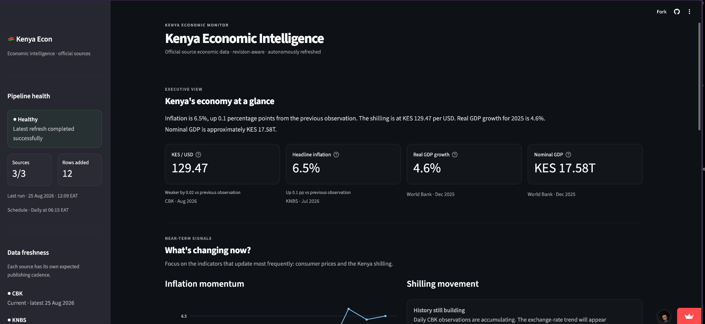
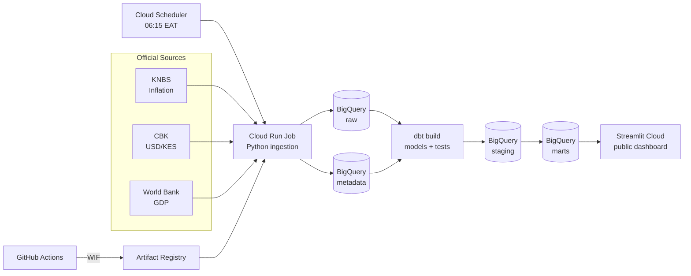

# 🇰🇪 Kenya Economic Intelligence

[](https://kenya-economic-intelligence.streamlit.app/)
[](https://github.com/gishusam/kenya-econ-pipeline/actions/workflows/ci.yml)


**A production data platform for collecting, versioning, validating, and publishing Kenya's core economic indicators from official sources.**

Kenya Economic Intelligence turns fragmented public economic releases from the **Kenya National Bureau of Statistics (KNBS)**, **Central Bank of Kenya (CBK)**, and the **World Bank** into a trusted, revision-aware analytical dataset and a continuously refreshed public dashboard.

**Live product:** [kenya-economic-intelligence.streamlit.app](https://kenya-economic-intelligence.streamlit.app/)

<p align="center">
  <a href="https://kenya-economic-intelligence.streamlit.app/">
    
  </a>
</p>

---

## Problem

Economic data is easy to find individually and difficult to operate reliably as a system.

Kenya's macroeconomic indicators are published by different institutions, on different schedules, and in different formats. A team tracking inflation, exchange rates, and GDP must repeatedly determine:

- which release is the latest authoritative observation;
- whether a historical value has been revised;
- how differently structured sources map into one analytical model;
- whether an unchanged value is legitimately current or unexpectedly stale;
- and whether downstream reports are using validated, up-to-date data.

The hard part is therefore not drawing a chart. It is building a data system that can **continuously acquire, reconcile, validate, version, and serve official observations without losing provenance or silently presenting stale data as current**.

---

## Solution

Kenya Economic Intelligence automates that operational layer end to end.

The platform:

1. checks official sources on a daily schedule;
2. converts source-specific responses into a canonical observation contract;
3. fingerprints source records so unchanged observations are not duplicated;
4. preserves historical revisions in an append-only BigQuery raw layer;
5. standardizes and tests the data with dbt;
6. publishes trusted analytical marts containing the latest valid revisions;
7. records source freshness and pipeline execution health;
8. serves the published layer through a public Streamlit data product.

The system runs independently of a developer workstation and exposes operational health alongside the economic metrics themselves.

---

## Architecture



### Data path

```text
Official sources
      ↓
source-specific adapters
      ↓
canonical observation + deterministic fingerprint
      ↓
BigQuery raw        ← append-only revision history
      ↓
dbt staging         ← normalized analytical contract
      ↓
dbt tests           ← quality gate
      ↓
BigQuery marts      ← latest trusted revisions
      ↓
Streamlit           ← economics + freshness + pipeline health
```

---

## Engineering highlights

| Capability | Implementation |
|---|---|
| **Revision-aware ingestion** | Historical source values are never overwritten. New revisions are appended and resolved downstream. |
| **Deterministic deduplication** | Canonical source records are fingerprinted so repeated checks do not create duplicate observations. |
| **Source isolation** | Each source is checked independently; one unavailable provider does not discard successful work from healthy sources. |
| **Data contracts** | Heterogeneous source payloads are normalized into a consistent observation model before publication. |
| **Automated data quality** | dbt tests act as a quality gate between warehouse layers and dashboard-facing marts. |
| **Freshness monitoring** | Source health is evaluated against the publishing cadence of each provider, not simply whether data changed today. |
| **Operational metadata** | Pipeline runs and source checks are recorded separately from analytical observations. |
| **Least-privilege serving** | The dashboard reads published marts only; raw, staging, and metadata datasets remain outside its direct access boundary. |
| **Authorized views** | Pipeline health is exposed to the dashboard without granting direct access to the underlying metadata table. |
| **Keyless CI/CD to GCP** | GitHub Actions authenticates through Workload Identity Federation rather than a long-lived deployment key. |
| **Autonomous execution** | Cloud Scheduler invokes the Cloud Run refresh job daily in production. |
| **Production validation** | CI runs unit tests, Python compilation, dbt parsing, and a Docker build before changes are accepted. |

---

## Warehouse design

The warehouse separates immutable source history, analytical transformation, serving models, and operational state.

```text
raw ───────────→ staging ───────────→ marts
 │                  │                   │
 │ source history   │ normalized data   │ published analytics
 │ revisions        │ revision ranking  │ dashboard contract
 │ provenance       │ dbt validation    │ latest valid values
 │
 └────────────── metadata
                 pipeline runs
                 source checks
                 health/freshness
```

### `raw`

`raw.economic_observations` is append-only. Each observation carries enough information to reconstruct where it came from and when it entered the platform, including:

- source and indicator identity;
- observation period and value;
- source URL and parsed source payload;
- deterministic source record hash;
- ingestion run ID and timestamp.

A source revision creates a new row rather than destroying the previous value.

### `staging`

`staging.stg_economic_observations` provides a consistent analytical contract across providers and ranks revisions using the natural observation key:

```text
(source, indicator_code, geography, period_start, period_end)
```

### `marts`

The dashboard consumes published models rather than querying ingestion tables directly.

Key models include:

- `marts.indicator_history` — revision-resolved historical series;
- `marts.latest_indicators` — latest valid observation per indicator;
- `marts.economic_snapshot` — compact cross-indicator economic view;
- `marts.source_health` — publishing freshness and source check status;
- `marts.pipeline_status` — latest pipeline execution state.

---

## Reliability model

A source failure and a pipeline failure are not treated as the same event.

| Condition | Pipeline state | Behaviour |
|---|---|---|
| All sources and dbt succeed | `success` | New valid observations are published |
| One or more sources fail, valid data remains available, dbt succeeds | `degraded` | Healthy source updates are retained and the failure is surfaced |
| dbt fails or every source fails | `failed` | The execution is marked failed and trusted marts are not silently treated as refreshed |

The serving layer follows one core rule:

> **Stale data may remain available, but it must never be represented as fresh.**

This allows consumers to distinguish an unchanged official publication from an unhealthy ingestion path.

---

## Security

The platform uses separate identities for separate responsibilities.

| Identity | Responsibility |
|---|---|
| `kenya-econ-pipeline` | Production ingestion and dbt runtime |
| `kenya-econ-scheduler` | Invoke the scheduled Cloud Run job |
| `kenya-econ-deploy` | GitHub Actions deployment identity |
| `kenya-econ-dashboard` | Read-only dashboard access to published marts |

Key controls:

- GitHub → GCP deployment uses **Workload Identity Federation**.
- The dashboard service account has **BigQuery Job User** plus dataset-scoped read access to `marts`.
- The dashboard cannot directly query `raw`, `staging`, or `metadata`.
- `marts.pipeline_status` uses a **BigQuery authorized view** to expose operational health without widening dashboard permissions.
- Streamlit credentials are kept outside the repository and loaded through secrets management.

---

## Tech stack

| Layer | Technology |
|---|---|
| Language | Python |
| Data sources | KNBS, Central Bank of Kenya, World Bank |
| Warehouse | Google BigQuery |
| Transformation | dbt-bigquery |
| Compute | Google Cloud Run Jobs |
| Scheduling | Google Cloud Scheduler |
| Containers | Docker |
| Container registry | Google Artifact Registry |
| CI/CD | GitHub Actions |
| Cloud authentication | Google Workload Identity Federation |
| Dashboard | Streamlit |
| Visualization | Plotly |
| Testing | pytest, dbt tests, compile checks, Docker build validation |

---

## Data sources

| Provider | Indicator | Cadence |
|---|---|---:|
| **KNBS** | Headline CPI inflation, year-on-year | Monthly |
| **CBK** | USD/KES exchange rate | Daily |
| **World Bank** | Real GDP growth | Annual |
| **World Bank** | GDP in current local currency | Annual |

The pipeline checks sources daily while preserving each provider's actual publishing cadence.

---

## Production workflow

### Scheduled data refresh

```text
06:15 EAT
   ↓
Cloud Scheduler
   ↓
Cloud Run Job
   ↓
Fetch sources
   ↓
Validate + fingerprint
   ↓
Append new/revised observations
   ↓
dbt build + tests
   ↓
Publish marts
   ↓
Dashboard reflects latest trusted state
```

### Delivery workflow

```text
Pull request / push
      ↓
GitHub Actions
      ↓
pytest + compile + dbt parse + Docker build
      ↓
Workload Identity Federation
      ↓
Artifact Registry
      ↓
Cloud Run deployment
      ↓
Scheduler configuration
```

---

## Repository structure

```text
pipeline/
├── models.py              # Canonical observation contract
├── hashing.py             # Deterministic source fingerprints
├── refresh.py             # Source-isolated refresh orchestration
├── warehouse.py           # BigQuery persistence
└── sources/
    ├── knbs.py
    ├── cbk.py
    └── world_bank.py

kenya_econ_dbt/
├── models/
│   ├── staging/
│   └── marts/
└── profiles.yml

dashboard/
├── app.py
└── data.py

infra/
├── bigquery/
└── gcp/

.github/workflows/
├── ci.yml
└── deploy.yml

tests/
streamlit_app.py
```

---

## Local development

Python 3.11 is the production runtime.

```bash
python -m venv .venv
source .venv/bin/activate
pip install -r requirements-dev.txt
pytest -q
```

Run the dashboard locally:

```bash
pip install -r dashboard/requirements.txt
streamlit run streamlit_app.py
```

Parse the dbt project:

```bash
export GCP_PROJECT_ID="your-project-id"
export BQ_LOCATION="africa-south1"

dbt parse \
  --project-dir kenya_econ_dbt \
  --profiles-dir kenya_econ_dbt \
  --target prod
```

---

## Production

The platform is deployed and operating in Google Cloud.

- **Dashboard:** [kenya-economic-intelligence.streamlit.app](https://kenya-economic-intelligence.streamlit.app/)
- **Refresh cadence:** daily at 06:15 Africa/Nairobi
- **Compute:** Cloud Run Jobs
- **Warehouse:** BigQuery
- **Transformations:** dbt
- **CI/CD:** GitHub Actions + Workload Identity Federation

---

## What this project demonstrates

This repository is intentionally an end-to-end data engineering system rather than a collection of isolated notebooks.

It demonstrates:

- designing ingestion around unreliable and heterogeneous external sources;
- preserving data lineage and historical revisions;
- separating raw, transformation, serving, and operational concerns;
- implementing automated data-quality gates;
- designing graceful degraded states rather than all-or-nothing ingestion;
- applying least-privilege IAM across runtime, deployment, scheduling, and serving identities;
- building CI/CD for cloud data workloads;
- and operating a public analytical product from continuously refreshed production data.

---

## License

This project is a portfolio and engineering demonstration built from publicly available economic data published by the referenced institutions.
